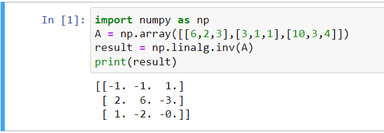

# INVERSE-OF-A-MATRIX
## Aim:
To write a python program to find the inverse of a matrix
## Equipment’s required:
1. 	Hardware – PCs
2. 	Anaconda – Python 3.7 Installation / Moodle-Code Runner
## Algorithm:
### Step1 :  
Import the numpy module to use the built-in functions for calculation
### Step 2: 
Get the matrix form from user using np.array(eval(input()))
### Step 3: 
Using np.linalg.inv() we can find the inverse of matrix
### Step 4: 
End the program
## Program:
~~~
#Program to find the inverse of a matrix.
#Developed by: M VIGNESH
#RegisterNumber: 21004061
import numpy as np
A = np.array([[6,2,3],[3,1,1],[10,3,4]])
result = np.linalg.inv(A)
print(result)

~~~
## Output: 
## Result:
Thus the inverse of given matrix is successfully solved using python program

